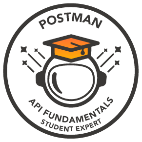

# 🎓 My Certificates & Certifications
A comprehensive collection of my professional certifications and completed courses, showcasing continuous learning and skill development.

---

## 📜 Certificates

<table>
<tr>
<td width="50%" valign="top">

### 5 Day AI Agent Intensive course with Google
**Key Learnings & Skills:**
- AI Agent architecture
- Agent tools interoperability
- Multi agent systems production

</td>
<td width="50%" valign="top">

### Google LLM Introduction
**Key Learnings & Skills:**
- Large Language Model fundamentals
- LLM architecture and components
- Prompt engineering for LLMs
- Practical applications of LLMs

</td>
</tr>

<tr>
<td width="50%" valign="top">

### OpenCV Bootcamp
**Key Learnings & Skills:**
- Computer Vision fundamentals
- Image processing techniques
- Object detection and recognition
- Real-time video processing

</td>
<td width="50%" valign="top">

### Postman API Fundamentals Student Expert
**Key Learnings & Skills:**
- API fundamentals and REST principles
- API testing and validation
- Postman collections and environments
- API documentation and automation

</td>
</tr>

<tr>
<td width="50%" valign="top">

### AI for Beginners by HP
**Key Learnings & Skills:**
- Introduction to AI
- Fundamentals of AI and Machine Learning
- Applications and Future scope

</td>
<td width="50%" valign="top">

### Introduction to Generative AI Studio
**Key Learnings & Skills:**
- Generative AI Studio basics
- Prompt engineering techniques
- Conversation model creation

</td>
</tr>

<tr>
<td width="50%" valign="top">

### Building Recommender Systems
**Key Learnings & Skills:**
- Recommender systems basics
- Content-based filtering
- Collaborative filtering algorithms

</td>
<td width="50%" valign="top">

### Data Analytics by HP
**Key Learnings & Skills:**
- Data analytics fundamentals
- Predictive modelling techniques
- Data Visualization

</td>
</tr>

<tr>
<td width="50%" valign="top">

### Introduction to Machine Learning
**Key Learnings & Skills:**
- Introduction to Machine Learning
- Supervised learning algorithms
- Unsupervised learning methods

</td>
<td width="50%" valign="top">

### Basics of Programming in Swift
**Key Learnings & Skills:**
- Swift basic syntax
- Variables, Functions and OOP in Swift
- iOS app development fundamentals

</td>
</tr>

<tr>
<td width="50%" valign="top">

### Python Certification by Kaggle
**Key Learnings & Skills:**
- Python syntax basics
- Data Structures and algorithms
- Data manipulation techniques

</td>
<td width="50%" valign="top">

### Fundamentals of AI
**Key Learnings & Skills:**
- AI Core concepts
- Machine Learning basics
- Introduction to neural networks

</td>
</tr>

<tr>
<td width="50%" valign="top">

### HackerRank Python Certification
**Key Learnings & Skills:**
- Python syntax fundamentals
- Data structures
- Basic algorithms and Problem solving

</td>
<td width="50%" valign="top">

### HackerRank CSS Certification
**Key Learnings & Skills:**
- CSS Box model
- Flexbox and Grid layouts
- Responsive Web Design

</td>
</tr>

<tr>
<td width="50%" valign="top">

### Complete Python Certification By Scaler
**Key Learnings & Skills:**
- Programming in Python
- OOP functions
- File handling and Exception handling

</td>
<td width="50%" valign="top">

### Sololearn Python
**Key Learnings & Skills:**
- Programming in Python
- OOP functions
- File handling and Exception handling

</td>
</tr>

<tr>
<td width="50%" valign="top">

### AI Certification by CMR University
**Key Learnings & Skills:**
- AI & ML programming fundamentals
- Machine learning models
- Deep learning techniques and applications
- Basics of Neural networks
- Introduction to Natural language processing

</td>
<td width="50%" valign="top">

</td>
</tr>

</table>

---

## 📊 Skills Summary
Based on the certifications above, I have developed expertise in:

### 💻 Programming Languages
Python • Swift • JavaScript • HTML • CSS • C

### 🤖 AI & Machine Learning
Machine Learning • Deep Learning • Neural Networks • Large Language Models • Generative AI • AI Agents • Computer Vision • Synthetic Data Generation 

### 📈 Data Science & Analytics
Data Analytics • Predictive Modeling • Data Visualization • Recommender Systems 

### 🔧 Tools & Frameworks
OpenCV • Google AI Studio • Numpy • Pandas • Keras • Tensorflow • Streamlit • Tailwind CSS • SDV • Postman

### 🌐 API Development & Testing
Postman API • API Testing • RESTful API Design

---

## 📫 Connect With Me
- 💼 LinkedIn: [Vignesh Poovanna](https://www.linkedin.com/in/vignesh-poovanna-a-s?utm_source=share&utm_campaign=share_via&utm_content=profile&utm_medium=android_app)
- 📧 Email: vigneshpoovannaas@gmail.com

---
